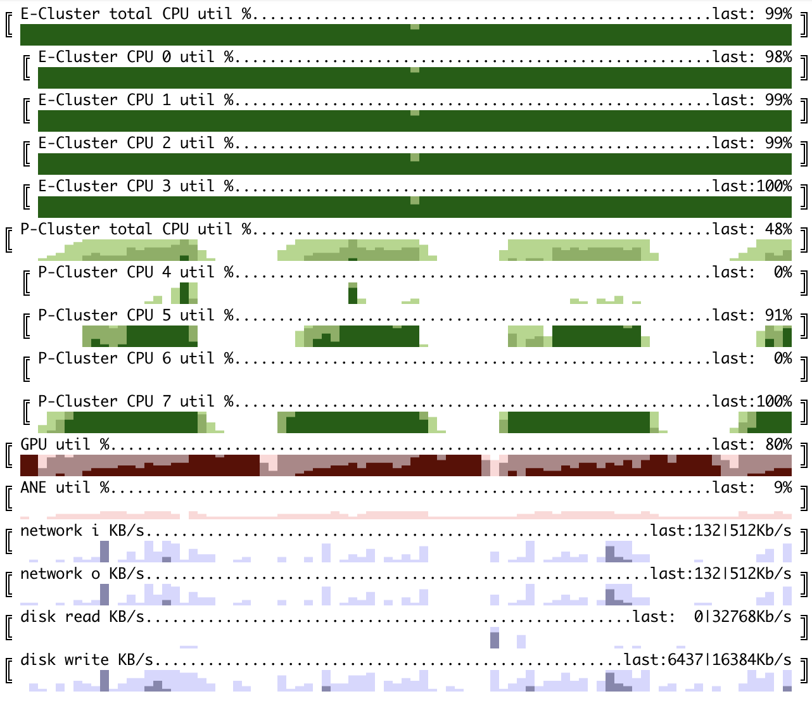
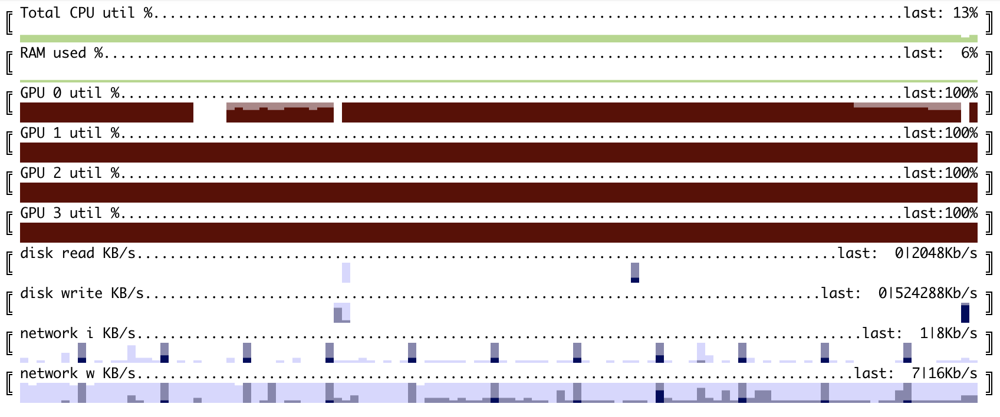

# system monitoring horizon charts for terminal

Let's start with example: running [deep RL loop](https://github.com/okuvshynov/rlscout) on a single MacBook Air M2:

We can see model training (on GPU), self-play (done on 4 performance CPU cores) and model evaluation, which runs inference on Neural Engine (ANE):


cubestat is a command-line utility to monitor usual system telemetry originally created for Apple M1/M2 devices.
At its current stage monitors:
1. CPU utilization - configurable per core ('expanded'), cluster of cores: Efficiency/Performance ('cluster') or both. Is shown as percentage.
2. GPU utilization per card/chip. Is shown in percentage. Works for Apple's M1/M2 SoC and nVidia GPUs.
3. ANE (Apple's Neural Engine) power consumption. According to `man powermetrics` it is an estimate, but seems working good enough as a proxy to ANE utilization. Is shown as percentage.
4. Disk and network IO; Is shown in Kb/s.
5. Memory usage in %

Despite many monitoring tools available for monitoring typical system counters as well as GPU/Accelerators, horizon charts have a unique information density properties which makes it possible to show a history of N measurements for M metrics on a single screen for significantly large N and M. Thus, this tool was created.

## Installation and Usage:

```
pip3 install cubestat

usage: cubestat [-h] [--refresh_ms REFRESH_MS] [--buffer_size BUFFER_SIZE] [--cpu {all,by_cluster,by_core}] [--color {red,green,blue,mixed}] [--percentages {hidden,last}] [--disk] [--network] [--no-disk] [--no-network]

options:
  -h, --help            show this help message and exit
  --refresh_ms REFRESH_MS, -i REFRESH_MS
                        Update frequency, milliseconds
  --buffer_size BUFFER_SIZE
                        How many datapoints to store. Having it larger than screen width is a good idea as terminal window can be resized
  --cpu {all,by_cluster,by_core}
                        CPU mode - showing all cores, only cumulative by cluster or both. Can be toggled by pressing c.
  --color {red,green,blue,mixed}
  --percentages {hidden,last}
                        Show/hide numeric utilization percentage. Can be toggled by pressing p.
  --disk                Show disk read/write. Can be toggled by pressing d.
  --network             Show network io. Can be toggled by pressing n.
  --no-disk             Hide disk read/write. Can be toggled by pressing d.
  --no-network          Hide network io. Can be toggled by pressing n.
```

Interactive commands:
* q - quit
* p - show/hide percentage for last data point
* c - change cpu display mode (individual cores, aggregated by cluster or both)
* d - show/hide disk reads/writes
* n - show/hide network utilization
* UP/DOWN - scroll the lines in case there are more cores.

Running on Apple devices will require sudo access, as `powermetrics` has this limitation. Running on Linux doesn't require it.

Multi-gpu example - training [nano GPT](https://github.com/karpathy/nanoGPT) on 4 nVidia GPU instance:


## Neural Engine utilization

A few notes on 'what does this even represent?'. Utilization we report is essentially power consumption reported by powermetrics.
To convert it to % we divide it by some 'maximum' value observed in experimentation. There are many drawbacks to this:
* The concept of 'utilization' overall it pretty ambiguous, e.g. for a x86 CPU - when CPU is wasting cycles on a cache miss, is it 'utilized' or not? If CPU is doing scalar instructions on 1 execution port rather than vectorized instructions on several ports, is it 'utilized' or not?
* It is unclear if power consumption is a decent proxy for utilization;
* The upper bound must be different for different models (M1, M1 Max, M2, etc.). Need to identify the model and do tests for them.
* It is unclear if my tests are actually hitting upperbound. The highest I could achieve was multiple layers of convolutions with no non-linearities between them (which makes model pretty useless)


## Dependencies
* Python 3.?+
* psutil 5.9.5
* pynvml for nVidia cards monitoring

## TODO
* Apple Neural Engine correct scale.
* GPU aggregation
* CPU by socket/NUMA/SMT
* status line (why though?)
* better colors (especially for dark background)
* multi-column layout for large instances (e.g. with 100+ cores)
* try on Windows and BSD
* Google TPU load?
* AMD GPU load?
* Filter by process?
* joint scale for IO