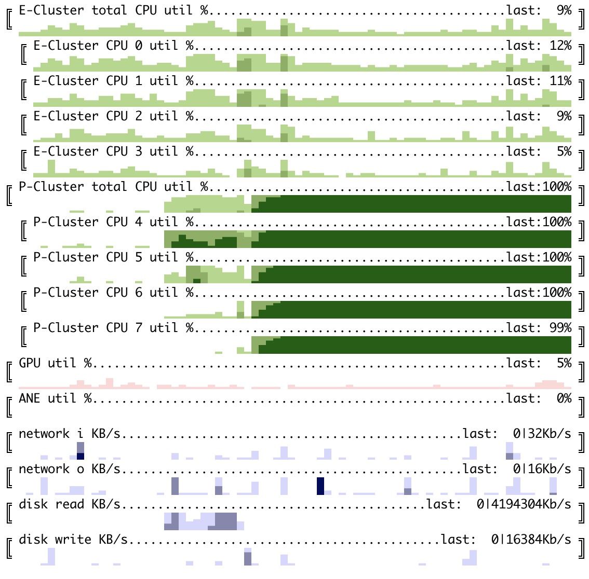

# system monitoring horizon charts for terminal

Let's start with example: running [deep RL loop](https://github.com/okuvshynov/rlscout) on a single MacBook Air M2:

We can see model training (on GPU), self-play (done on 4 performance CPU cores) and model evaluation, which runs inference on Neural Engine (ANE):


cubestat is a command-line utility to monitor usual system telemetry originally created for Apple M1/M2 devices.
At its current stage monitors:
1. CPU utilization - configurable per core ('expanded'), cluster of cores: Efficiency/Performance ('cluster') or both. Is shown as percentage.
2. GPU utilization per card/chip. Is shown in percentage. Works for Apple's M1/M2 SoC and nVidia GPUs.
3. ANE (Apple's Neural Engine) power consumption. According to `man powermetrics` it is an estimate, but seems working good enough as a proxy to ANE utilization. Is shown as percentage.
4. Disk and network IO; Is shown in Kb/s.
5. Memory usage in %

Despite many monitoring tools available for monitoring typical system counters as well as GPU/Accelerators, horizon charts have a unique information density properties which makes it possible to show a history of N measurements for M metrics on a single screen. Thus, this tool was created.

## Installation and Usage:

```
pip3 install cubestat

usage: cubestat [-h] [--refresh_ms REFRESH_MS] [--buffer_size BUFFER_SIZE]
                [--cpu {all,by_cluster,by_core}] [--color {red,green,blue,mixed}]
                [--percentages {hidden,last}] [--disk] [--network]

options:
  -h, --help            show this help message and exit
  --refresh_ms REFRESH_MS, -i REFRESH_MS
                        Update frequency, milliseconds
  --buffer_size BUFFER_SIZE
                        How many datapoints to store. Having it larger than screen width is a good
                        idea as terminal window can be resized
  --cpu {all,by_cluster,by_core}
                        CPU mode - showing all cores, only cumulative by cluster or both. Can be
                        toggled by pressing c.
  --color {red,green,blue,mixed}
  --percentages {hidden,last}
                        Show/hide numeric utilization percentage. Can be toggled by pressing p.
  --disk                show disk read/write. Can be toggled by pressing d.
  --network             show network io. Can be toggled by pressing n.
```

Running on Apple devices will require sudo access, as `powermetrics` has such limitation. Running on Linux machines doesn't have this limitation.

Another example running [GPT inference on ggml](https://github.com/ggerganov/ggml): 


Multi-gpu example - training [nano GPT](https://github.com/karpathy/nanoGPT) on 4 nVidia GPU instance:


## Dependencies
* Python 3.7+
* psutil 5.9.5
* pynvml for nVidia cars monitoring
