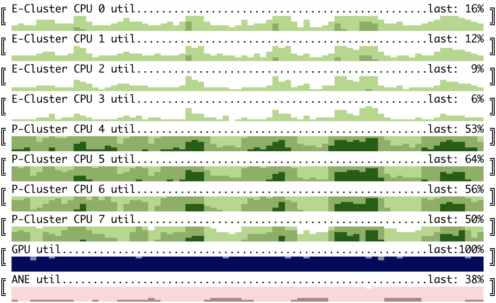

# Horizon charts for Apple M1/M2 monitoring

Command-line utility to monitor CPU/GPU/NeuralEngine utilization on Apple M1/M2 devices. Requires sudo access as it calls `powermetrics` and parses its output.

```
usage: ./cubestat.py [-h] [--refresh_ms REFRESH_MS]
                     [--buffer_size BUFFER_SIZE]
                     [--cpu {all,by_cluster,by_core}]
                     [--color {red,green,blue,mixed}]
                     [--percentages {hidden,last}]

options:
  -h, --help            show this help message and exit
  --refresh_ms REFRESH_MS, -i REFRESH_MS
                        This argument is passed to powermetrics as -i
  --buffer_size BUFFER_SIZE
                        How many datapoints to store. Having it larger than
                        screen width is a good idea as terminal window can
                        be resized
  --cpu {all,by_cluster,by_core}
                        CPU mode - showing all cores, only cumulative by
                        cluster or both. Can be toggled by pressing c.
  --color {red,green,blue,mixed}
  --percentages {hidden,last}
                        Show/hide numeric utilization percentage. Can be
                        toggled by pressing p.
```

Monitors:
1. CPU utilization - configurable per core ('expanded'), cluster of cores: Efficiency/Performance ('cluster') or both;
2. GPU utilization;
3. ANE power consumption. According to `man powermetrics` it is an estimate, but seems working good enough as a proxy to ANE utilization.

Could add more data from powermetrics (e.g. frequency, IO stats for disk and network), but it was adding too much visual noise.

Example: running [deep RL loop](https://github.com/okuvshynov/rlscout) (self play to generate data, model training, model evaluation) on a single MacMini M1:


