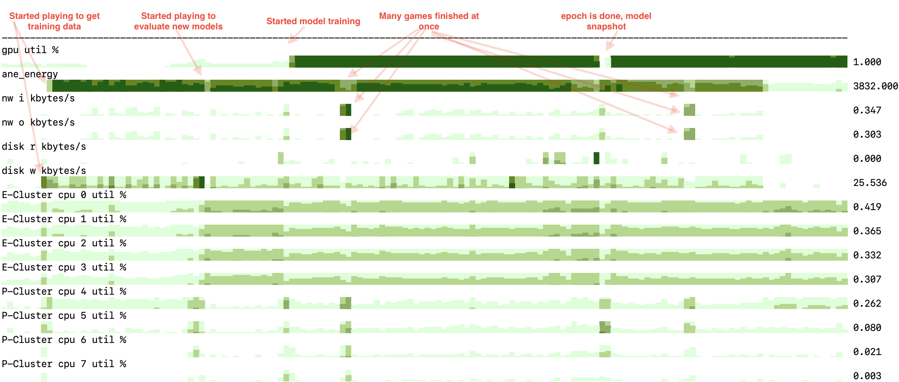

simpler version of horizon chart for terminal, for now has 3 versions:

1. apple M1/M2 SoC 
2. nvidia GPU
3. generic oneline

Just prints things to stdout, refreshes every second, monitors:
1. CPU util
2. GPU util
3. ANE util (or, more precisely, power consumption)
4. disk io
5. network io

No use of curses or any other terminal interactivity. Needs 256 colors terminal.

Example: running [deep RL loop](https://github.com/okuvshynov/rlscout) (self play to generate data, model training, model evaluation) on a single MacBook Air:



next:
0. common lib for horizon itself, specific implementations
1. can add frequencies
2. make more interactive
3. figure out what 'ane power consumption' is, what's the %% here


For nvidia version, 

```pip install pynvml```
