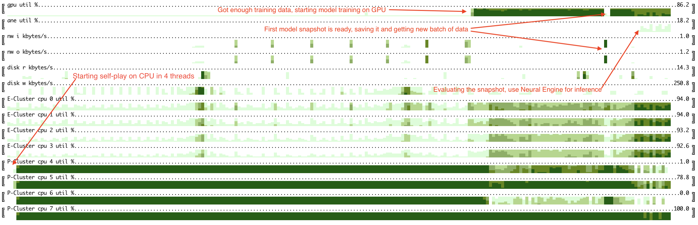

# Horizon charts for Apple M1/M2 monitoring

Command-line utility to monitor CPU/GPU/NeuralEngine utilization on Apple M1/M2 devices.

Usage:
```
% ./cubestat.py --help
usage: cubestate monitoring [-h] [--refresh_ms REFRESH_MS]
                            [--buffer_size BUFFER_SIZE]
                            [--cpu {collapsed,expanded,cluster}]
                            [--color {red,green,blue,mixed}]

options:
  -h, --help            show this help message and exit
  --refresh_ms REFRESH_MS, -i REFRESH_MS
                        This argument is passed to powermetrics as -i
  --buffer_size BUFFER_SIZE
                        How many datapoints to store. Having it larger than screen
                        width is a good idea as terminal window can be resized
  --cpu {collapsed,expanded,cluster}
  --color {red,green,blue,mixed}
```

Will ask for sudo access as it calls `powermetrics` and parses its output.

Monitors:
1. CPU utilization - configurable per core ('expanded'), cluster of cores: Efficiency/Performance ('cluster') or overall ('collapsed');
2. GPU utilization;
3. ANE power consumption. According to `man powermetrics` it is an estimate, but seems working good enough as a proxy to ANE utilization.

Could add more data from powermetrics (e.g. frequency, IO stats for disk and network), but it was adding too much visual noise.

Example: running [deep RL loop](https://github.com/okuvshynov/rlscout) (self play to generate data, model training, model evaluation) on a single MacBook Air:


