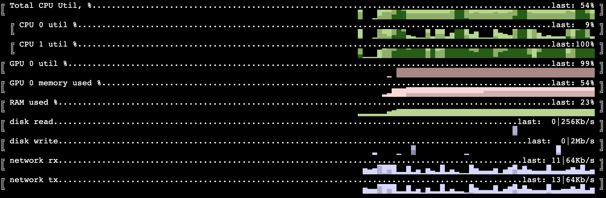

# system monitoring horizon charts for terminal

cubestat is a command-line utility to monitor system metrics in horizon chart format. It was originally created for Apple M1/M2 devices, but now works on Linux with nVidia GPU as well, including Google Colab environment.

Let's start with an example:

In the clip below we see Mixtral-8x7b inference on MacBook Air with FF layers offloaded to SSD. 
We can notice somewhat low GPU util, 2Gb/s+ of data read from disk, as we have to fetch the weights, but plenty of free RAM (And we are actually able to serve almost 100Gb model on 24Gb machine with fp16 precision).
We can also see the disk writes before the inference started - that was model preprocessing which was writing the weights to disk individually.

https://github.com/okuvshynov/cubestat/assets/661042/8e1e405e-ca61-4ffb-bedb-e04eb33f8bc2

Currently cubestat reports:
1. CPU utilization - configurable per core ('by_core'), cluster of cores on Apple M1+: Efficiency/Performance ('by_cluster') or all. Is shown as percentage.
2. GPU utilization per card/chip. Is shown in percentage. Works for Apple's M1/M2 SoC and nVidia GPUs. For nVidia GPU shows memory usage as well. In case of multi-GPU can show individual GPUs or aggregated average.
3. ANE (Neural Engine) power consumption. According to `man powermetrics` it is an estimate, but seems working good enough as a proxy to ANE utilization. Is shown as percentage.
4. Disk and network IO; Is shown as rate (Kb/s, Mb/s, Gb/s).
5. Memory usage in %
6. Swap usage. Is shown as absolute value (Kb, Mb, Gb)

Despite many monitoring tools available for system counters, horizon charts have nice information density properties which make it possible to show a history of N measurements for M metrics on a single screen for significantly large N and M. Thus, this tool was created.

## Installation and Usage:

```
% pip install cubestat

% cubestat [-h] [--refresh_ms REFRESH_MS] [--buffer_size BUFFER_SIZE] [--cpu {all,by_cluster,by_core}]
                [--gpu {collapsed,load_only,load_and_vram}] [--color {red,green,blue,pink,mixed}]
                [--percentages {hidden,last}] [--disk] [--swap] [--network] [--no-disk] [--no-swap] [--no-network]

options:
  -h, --help            show this help message and exit
  --refresh_ms REFRESH_MS, -i REFRESH_MS
                        Update frequency, milliseconds
  --buffer_size BUFFER_SIZE
                        How many datapoints to store. Having it larger than screen width is a good idea as terminal window
                        can be resized
  --cpu {all,by_cluster,by_core}
                        CPU mode - showing all cores, only cumulative by cluster or both. Can be toggled by pressing c.
  --gpu {collapsed,load_only,load_and_vram}
                        GPU mode - hidden, showing all GPUs load, or showing load and vram usage. Can be toggled by pressing
                        g.
  --color {red,green,blue,pink,mixed}
  --percentages {hidden,last}
                        Show/hide numeric utilization percentage. Can be toggled by pressing p.
  --disk                Show disk read/write. Can be toggled by pressing d.
  --swap                Show swap . Can be toggled by pressing s.
  --network             Show network io. Can be toggled by pressing n.
  --no-disk             Hide disk read/write. Can be toggled by pressing d.
  --no-swap             Hide swap. Can be toggled by pressing s.
  --no-network          Hide network io. Can be toggled by pressing n.
```

Interactive commands:
* q - quit
* p - show/hide values for last data point
* c - change cpu display mode (individual cores, aggregated or both)
* g - change gpu display mode (individual gpus, aggregated and vram usage)
* d - show/hide disk reads/writes
* n - show/hide network utilization
* s - show/hide swap
* UP/DOWN - scroll the lines in case there are more cores;
* LEFT/RIGHT - scroll left/right. Autorefresh is paused when user scrolled to non-latest position. To resume autorefresh either scroll back to the right or press '0';
* 0 - reset horizontal scroll, continue autorefresh.

Running on Apple devices will require sudo access, as `powermetrics` has this requirement. If you are comfortable doing that, you can update /etc/sudoers to not require password to run powermetrics.

Running on Linux doesn't require sudo.

## Multi-gpu example 

https://github.com/okuvshynov/cubestat/assets/661042/c5e0750d-9bbd-4636-a1ea-71cc75ebbadb

We see a workload with uneven distribution between 4 GPUs installed. By pressing 'g' we can toggle the view mode to either show aggregate load, per GPU load or per GPU load and VRAM usage.

## Apple Neural Engine utilization

A few notes on 'what does this even represent?'. Utilization we report is essentially power consumption reported by powermetrics.
To convert it to % we divide it by some 'maximum' value observed in experimentation. There are many drawbacks to this:
* The concept of 'utilization' overall it pretty ambiguous, e.g. for a x86 CPU - when CPU is wasting cycles on a cache miss, is it 'utilized' or not? If CPU is doing scalar instructions on 1 execution port rather than vectorized instructions on several ports, is it 'utilized' or not?
* It is unclear if power consumption is a decent proxy for utilization;
* The upper bound must be different for different models (M1, M1 Max, M2, etc.). Need to identify the model and do tests for them.
* It is unclear if my tests are actually hitting upperbound. The highest I could achieve was multiple layers of convolutions with no non-linearities between them;

## Running on Google Colab 

We can run cubestat on Google Colab instances to monitor GPU/CPU/IO usage.

First cell:
```
!pip install cubestat
!pip install colab-xterm
!pip install pynvml
%load_ext colabxterm
# export TERM=xterm-256color <---- RUN THIS IN TERMINAL
# cubestat                   <---- RUN THIS IN TERMINAL
```

Start xterm:
```
%xterm
```

In the terminal, configure 256 colors and start cubestat:
```
# export TERM=xterm-256color
# cubestat
```

Example notebook: [colab example](https://colab.research.google.com/drive/1EUOXGJ-WUYfrKjy0oC_H2ZkVRgiSWGcC#scrollTo=0sm8bcE1QgbW)




## Dependencies
* Python 3.?+
* psutil 5.9.5+
* [optional] pynvml for nVidia cards monitoring

## TODO
* colors for dark background
* multi-column layout for large instances (e.g. with 100+ cores)
* joint scale for IO
* showing time
* storing history
* show help
